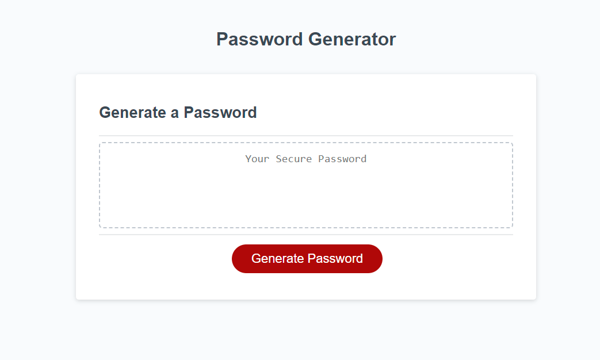
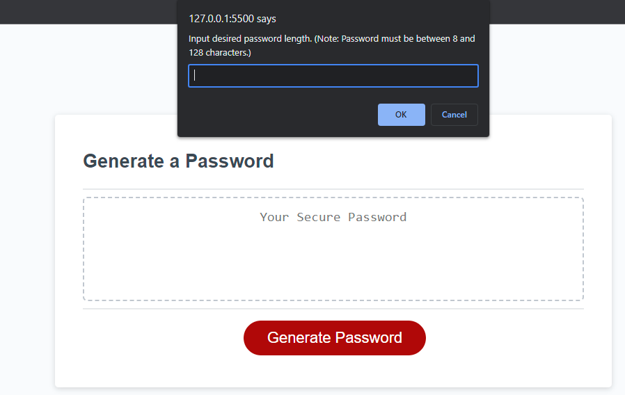
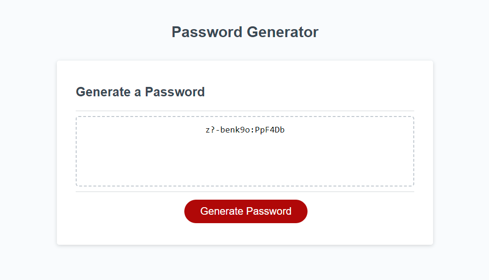

# password-generator

## Description

This password generator was created to easily generate a randomized password for logins. You can select length and types of characters to include in your generated password.

## Installation

N/A

## Usage

To use, simply click the 'Generate Password' button in the center of the screen and follow the prompts. 

After selecting the length and type of characters you want to include, it will display it within the center of the page to easily copy.

## Credits

N/A

## License

N/A